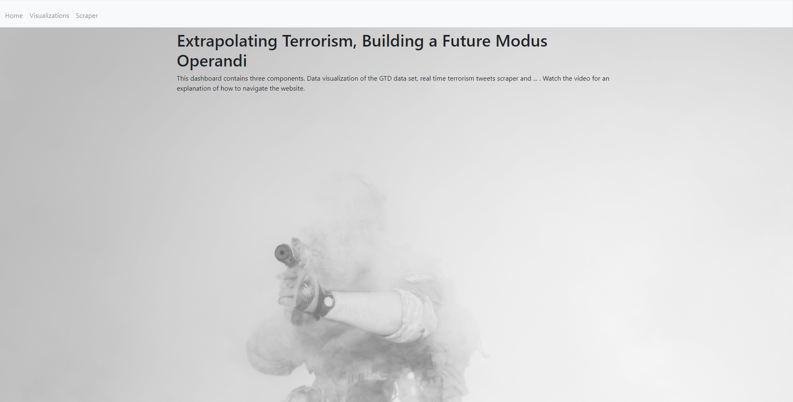
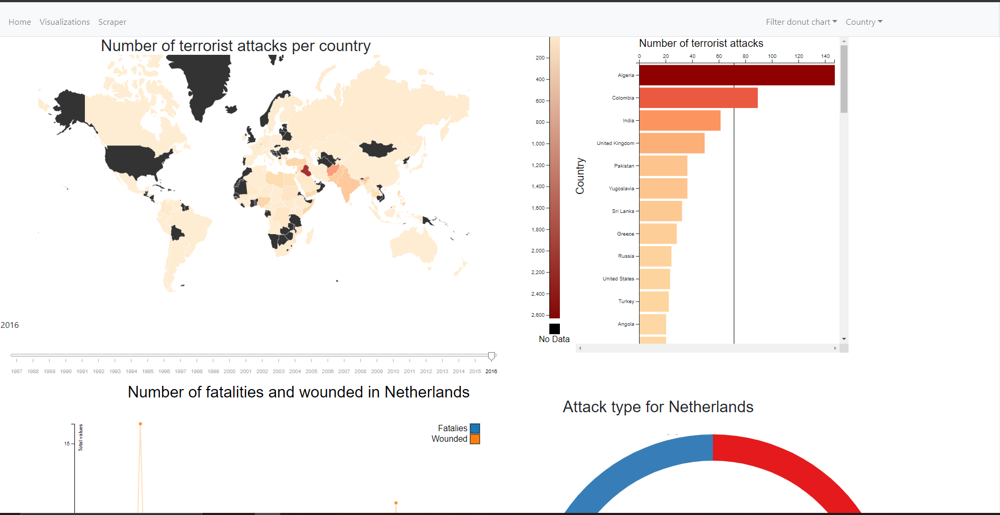
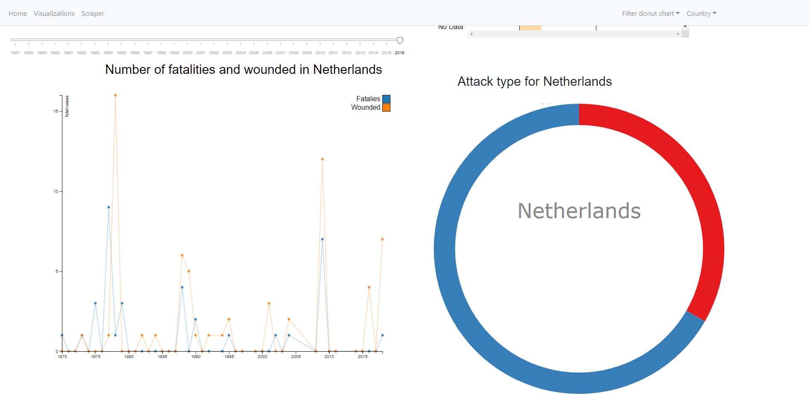
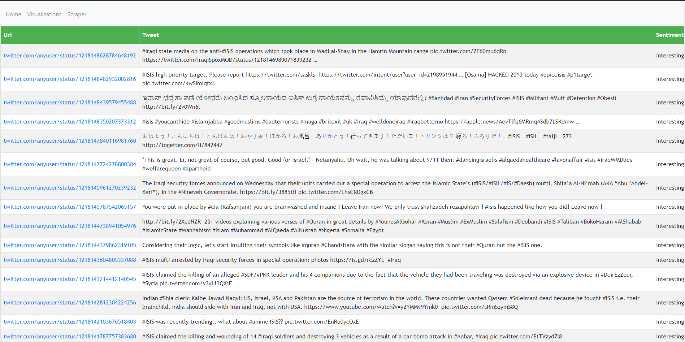

# DataSystems - Extrapolation Terrorism, Building a Future Modus Operandi

# Github pages
[link to github pages](https://rushkock.github.io/terrorism_DS/visualizations/build/)

# Home

# Visualizations
The visualizations page visualized the Global terrorism database [source](https://www.start.umd.edu/data-tools/global-terrorism-database-gtd). The visualizations are made in D3 js version 5. There are four components each visualizing the data in a different way. 

The first component is a world map, it shows the number of successful terrorist attacks per year. A range from orange to red is used to show the increase in the dataset. Dark red is a large number of successful attacks and light orange denotes almost no attacks. The barchart compliments the worldmap showing the same data (number of successful terrorist attacks per country). However, it gives a hierarchical view of the data. In the barchart you clearly see which country had the most attacks and which country the least. 

The linechart shows the number of wounded victims and the number of fatalities for one country. The donutchart shows possibly three different things. First, what type of attack was commited, per example bombing or kidnapping. Then it can show the name of the terrorist group behind the attacks, per example isis. Furthemore, it can show the target of the terrorist attack, per example the goverment. This can be updated with the dropdown at the top left of the page called "filter donut chart". 
The donutchart and linechart can be updated by clicking on the worldmap on a country and it will display the data for that country or by choosing a country with the dropdown. 

Finally, the data can be shown per year to see growing trends. This can be done with the slider. If a year is changed on the slider, it will update all 4 components on the page to display the data of that year. 

We conducted a testing phase for the website where we asked 10 peers and 1 software developer for feedback. The results of this analysis can be found in the report. For future work, more components of the dataset can be visualized, furthermore the design can be improved, per example the colors used should be colorblind safe, when the data is large the red becomes very large to the point of almost black. This can be confused with no data. A fix for this can be to make the countries with no data grey or set values between a fixed range to a fixed color. 

# Scraper
Insert description

